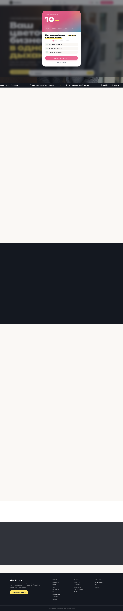
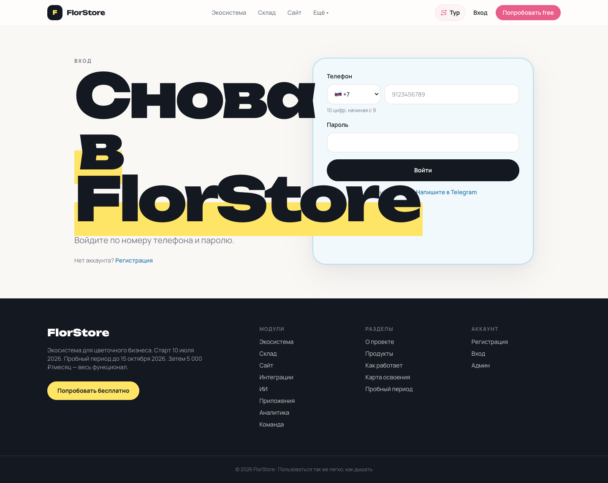
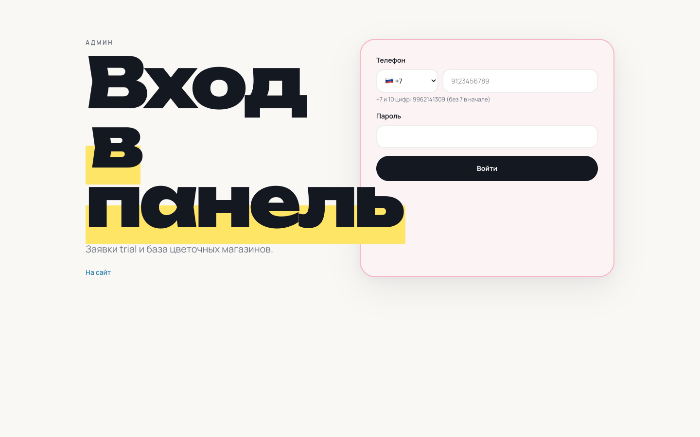
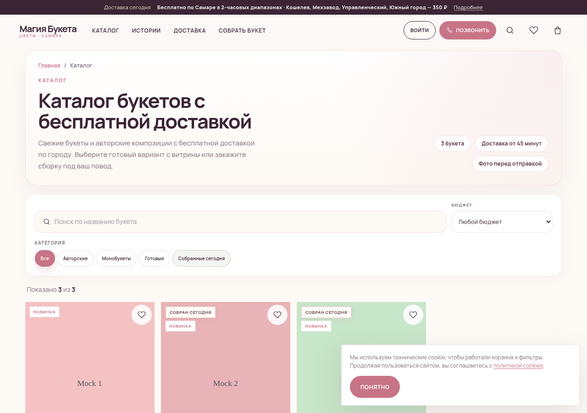
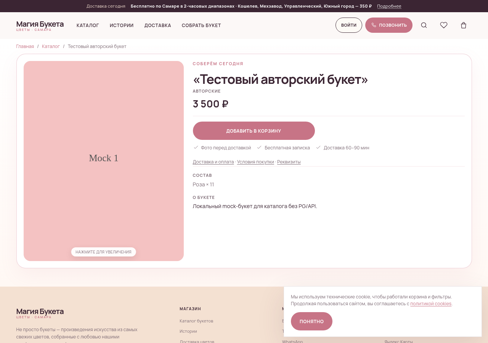
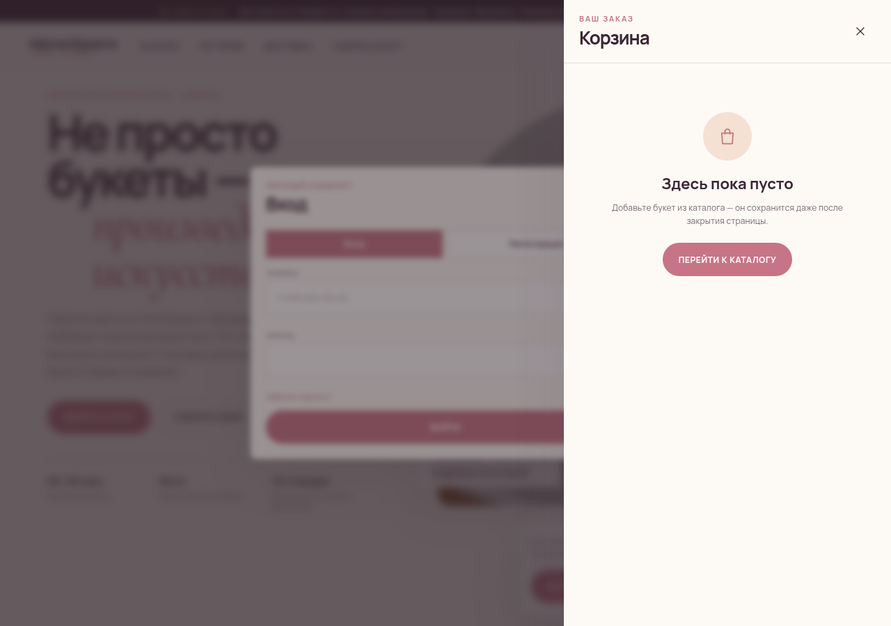
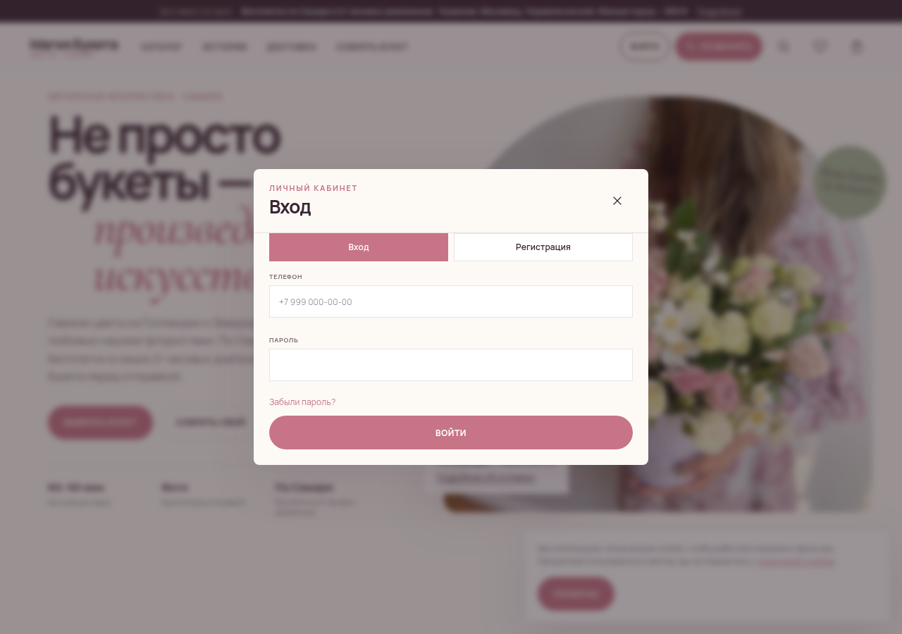

# FlorStore — Flower Shop SaaS Ecosystem

**FlorStore** is a multi-tenant flower-shop platform: per-shop APIs, web cabinets, public storefronts, Telegram messenger relay, and integrations with marketplaces (Flowwow, VK, Yandex). Modules share one product story but live in **separate private repos** for deploy boundaries.

> Public portfolio index · private application source · author: Michael / [asydneysummer](https://github.com/asydneysummer)  
> **Access:** all module repos below are private — [open an issue here](https://github.com/asydneysummer/florstore-ecosystem/issues) or contact the author to request read access for interviews.

## At a glance

| Layer | What it does | Repo |
|-------|----------------|------|
| Control plane | Subscriptions, entitlements, platform billing | [florstore-api-admin](https://github.com/asydneysummer/florstore-api-admin) *(private — request access)* |
| Shop backend | POS, deals, nomenclature — one VPS per tenant | [florstore-api-shop](https://github.com/asydneysummer/florstore-api-shop) *(private — request access)* |
| Staff UI | Store cabinet + florist PWA | [florstore-web](https://github.com/asydneysummer/florstore-web) *(private — request access)* |
| Public web | Marketing site + tenant storefronts | [florstore-site](https://github.com/asydneysummer/florstore-site) *(private — request access)* |
| Messenger | MTProto relay on EU VPS | [florstore-telegram-gateway](https://github.com/asydneysummer/florstore-telegram-gateway) *(private — request access)* |
| Integrations | XLSX ETL, marketplace feeds | [florstore-x-butonika](https://github.com/asydneysummer/florstore-x-butonika) *(private — request access)* |

## Screenshots

Production UI samples (no credentials or customer data). Full-size assets live under `docs/screenshots/`.

### Platform marketing site — [florstore.store](https://florstore.store)

Landing, onboarding funnel, and tenant login entry points for the FlorStore product.

| | |
|---|---|
|  | **Home** — value proposition, lead capture, product positioning |
|  | **Tenant login** — storefront operator sign-in |
|  | **Platform admin entry** — separate auth surface for operators |

### Tenant storefront example — KupiBuket / «Магия Букета» (Samara)

A live-style tenant shop on the FlorStore site stack: catalog, product detail, cart, and authenticated areas. Illustrates white-label theming and e-commerce flows end-to-end.

| | |
|---|---|
|  | **Home** — hero, delivery promises, primary CTAs |
|  | **Catalog** — categories, filters, grid layout |
|  | **Product** — bouquet detail, pricing, add-to-cart |
|  | **Cart** — line items and checkout path |
|  | **Account** — login / registered customer area |

---

## Module portfolio

### florstore-api-admin — platform control plane

**Repository:** [florstore-api-admin](https://github.com/asydneysummer/florstore-api-admin) *(private — request access)* · **Deploy:** central platform server

**Purpose.** Single admin PostgreSQL and HTTP API for everything that is *not* tied to one flower shop: tenant records, subscription state, feature entitlements, support workflows, and billing events that shop servers must honor.

**Architecture highlights.**

- Express + Prisma on PostgreSQL; strict separation from per-shop data planes.
- Shop instances pull or refresh **entitlements** via **HMAC-signed** requests so tampering without platform keys is rejected.
- Billing and onboarding events from the public site sync into admin through **authenticated server-to-server** endpoints (no shared credentials in this repo).

**Key engineering work (representative).**

- Entitlement model wired to subscription lifecycle (enable/disable modules per tenant).
- Secure inter-service auth between admin and each `florstore-api-shop` instance.
- APIs consumed by desktop **florstore-admin** tooling and by **florstore-site** for registration and billing alignment.

**Related UI.** Platform operator login surface (see [admin-login screenshot](docs/screenshots/florstore-site/admin-login.png)).

---

### florstore-api-shop — per-tenant shop backend

**Repository:** [florstore-api-shop](https://github.com/asydneysummer/florstore-api-shop) *(private — request access)* · **Deploy:** dedicated VPS per shop (native Node, no Docker requirement)

**Purpose.** Authoritative backend for one flower business: users and roles, deals/orders/POS, and nomenclature (products, bundles, pricing).

**Architecture highlights.**

- **Three PostgreSQL databases** on the shop server — `fsusers`, `fsdeals`, `fsnomenclature` — to isolate schemas and backup/restore boundaries while keeping one deploy unit.
- Periodic **entitlement refresh** against admin so disabled features disappear server-side, not only in UI.
- Integrations: Telegram gateway webhooks, marketplace export pipelines, optional Butonika ETL targets.

**Key engineering work (representative).**

- Multi-DB Prisma layout and migration discipline per database.
- Deal lifecycle (cart → order → fulfillment) and staff POS flows.
- Role-aware authorization aligned with **florstore-web** (managers, florists, couriers, etc.).

---

### florstore-web — staff cabinet and florist PWA

**Repository:** [florstore-web](https://github.com/asydneysummer/florstore-web) *(private — request access)* · **Deploy:** `store.{tenant-domain}`, `app.{tenant-domain}`

**Purpose.** Day-to-day operations UI: order queue, nomenclature maintenance, customer comms, and a **Progressive Web App** for florists on the shop floor.

**Architecture highlights.**

- React + Vite + Tailwind; talks only to the **local shop API** for tenant data.
- Messenger features proxy through **florstore-telegram-gateway** (HTTPS + inbox webhooks) so MTProto stays on the EU VPS.
- PWA install path for mobile florists without a separate native app store release.

**Key engineering work (representative).**

- Role-based navigation and API guards matching shop `fsusers` roles.
- Real-time or near-real-time order boards and status transitions.
- Telegram conversation UI integrated with gateway proxy semantics.

---

### florstore-site — marketing and tenant storefronts

**Repository:** [florstore-site](https://github.com/asydneysummer/florstore-site) *(private — request access)* · **Production:** [florstore.store](https://florstore.store)

**Purpose.** Public marketing for FlorStore plus **multi-tenant storefronts** (each shop gets themed catalog, cart, checkout, and content pages on shared infrastructure).

**Architecture highlights.**

- React/Vite frontends; tenant resolution by host or path strategy.
- Registration and billing flows call **florstore-api-admin** over authenticated backend channels.
- Storefront cart/checkout ultimately backed by the tenant’s **florstore-api-shop** (not admin DB).

**Key engineering work (representative).**

- Tenant theming (brand colors, typography, hero content) without forking code per shop.
- SEO-friendly catalog and product pages; cookie/consent and regional copy patterns.
- Lead capture and onboarding modals on the main marketing site (see [home screenshot](docs/screenshots/florstore-site/home.png)).

---

### Case study — KupiBuket63 («Магия Букета», Samara)

**What it demonstrates.** A full **tenant storefront** on FlorStore: branded home, catalog, bouquet PDP, cart, and customer login — the same module set a new shop receives after onboarding.

**Roles (typical mapping on this tenant).**

| Role | Where | Responsibility |
|------|--------|----------------|
| **Platform operator** | florstore-admin + api-admin | Tenant provisioning, subscription, support |
| **Shop owner / manager** | florstore-web (`store.*`) | Pricing, staff, order oversight |
| **Florist** | florstore-web PWA (`app.*`) | Assembly status, handoff to delivery |
| **Courier** | florstore-web | Delivery runs, status updates |
| **Customer** | tenant site (kupibuket63) | Browse, cart, account, order history |

**Architecture on this tenant.**

```
Customer browser ──► florstore-site (tenant theme)
                           │
                           ▼
              florstore-api-shop (tenant VPS)
                     │ fsusers / fsdeals / fsnomenclature
                     │
                     ├── HMAC entitlements ◄── florstore-api-admin
                     └── optional ◄──► florstore-telegram-gateway

Staff browsers ──► florstore-web ──► same shop API
```

**Key work illustrated (public-facing).**

- Custom brand and Samara-specific delivery messaging on home and catalog.
- Product photography and bouquet composition UX on PDP.
- Cart and checkout UX wired to shop deals DB (screenshots in [docs/screenshots/kupibuket63/](docs/screenshots/kupibuket63/)).

---

### Other modules (brief)

| Module | Repository | Notes |
|--------|------------|--------|
| **Telegram gateway** | [florstore-telegram-gateway](https://github.com/asydneysummer/florstore-telegram-gateway) *(private — request access)* | Python MTProto on Finland VPS; shop API and web never hold Telegram session keys directly. |
| **Butonika bridge** | [florstore-x-butonika](https://github.com/asydneysummer/florstore-x-butonika) *(private — request access)* | XLSX import/export and feeds for Flowwow, VK, Yandex Market. |

---

## Features (ecosystem)

- Per-shop backend API with three PostgreSQL databases (users, deals, nomenclature)
- Central admin API for subscriptions, entitlements, and support
- Web cabinet for shop staff + florist PWA
- Public marketing site and tenant storefronts
- Telegram Personal messenger relay via Finland VPS (MTProto)
- Butonika bridge: XLSX ETL and marketplace feed export

## Architecture (high level)

```
                    Platform server
                    ┌─────────────────────┐
   florstore-admin  │ florstore-api-admin │◄── HMAC ── florstore-api-shop (×N)
   (desktop)       │  admin PostgreSQL   │              fsusers / fsdeals / fsnomenclature
                    └──────────┬──────────┘                      │
                               │                                 │
                    florstore-site (public)              florstore-web + florist PWA
                               │                                 │
                               └──────── billing / onboarding ───┘

   Finland VPS: florstore-telegram-gateway ◄──► shop API ◄──► Telegram MTProto
```

## Cross-module integrations

| From | To | Mechanism |
|------|-----|-----------|
| florstore-api-shop | florstore-api-admin | HMAC-signed entitlement refresh |
| florstore-web | florstore-telegram-gateway | HTTPS proxy + webhook inbox |
| florstore-site | florstore-api-admin | Authenticated billing / onboarding sync |
| florstore-x-butonika | shop nomenclature | XLSX ETL → feeds (Flowwow/VK/Yandex) |

## Tech stack

- **Backend:** Node.js, Express, Prisma, PostgreSQL
- **Frontend:** React, Vite, Tailwind, PWA
- **Telegram:** Python MTProto gateway on EU VPS
- **Deploy:** Native per-shop servers (no Docker for shop API)

## Related portfolio

| Ecosystem | Index |
|-----------|-------|
| **HopeClass** (EdTech) | [hopeclass-ecosystem](https://github.com/asydneysummer/hopeclass-ecosystem) |
| **Buketov** (beauty salon CRM) | [buketov-app](https://github.com/asydneysummer/buketov-app) *(private — request access)* |

*This repository is a **public index only** — no application source, secrets, or production configuration.*

---

# FlorStore — экосистема SaaS для цветочных магазинов

**FlorStore** — мультитенантная платформа для цветочных магазинов: API на каждый магазин, веб-кабинеты, публичные витрины, Telegram-шлюз мессенджера и интеграции с маркетплейсами (Flowwow, VK, Яндекс). Модули образуют единый продукт, но вынесены в **отдельные приватные репозитории** для границ деплоя.

> Публичный портфолио-индекс · приватные исходники · автор: Michael / [asydneysummer](https://github.com/asydneysummer)  
> **Доступ:** все модули ниже в приватных репозиториях — [issue в этом репо](https://github.com/asydneysummer/florstore-ecosystem/issues) или личный контакт для доступа при собеседовании.

## Кратко

| Слой | Назначение | Репозиторий |
|------|------------|-------------|
| Control plane | Подписки, entitlements, биллинг платформы | [florstore-api-admin](https://github.com/asydneysummer/florstore-api-admin) *(приватный — запросите доступ)* |
| Backend магазина | POS, сделки, номенклатура — VPS на tenant | [florstore-api-shop](https://github.com/asydneysummer/florstore-api-shop) *(приватный — запросите доступ)* |
| UI персонала | Кабинет + PWA флорист | [florstore-web](https://github.com/asydneysummer/florstore-web) *(приватный — запросите доступ)* |
| Публичный web | Маркетинг + витрины tenant-ов | [florstore-site](https://github.com/asydneysummer/florstore-site) *(приватный — запросите доступ)* |
| Мессенджер | MTProto-реле на EU VPS | [florstore-telegram-gateway](https://github.com/asydneysummer/florstore-telegram-gateway) *(приватный — запросите доступ)* |
| Интеграции | ETL XLSX, фиды маркетплейсов | [florstore-x-butonika](https://github.com/asydneysummer/florstore-x-butonika) *(приватный — запросите доступ)* |

## Скриншоты

Примеры боевого UI (без учётных данных и персональных данных клиентов). Файлы: `docs/screenshots/`.

### Маркетинг платформы — [florstore.store](https://florstore.store)

Лендинг, воронка лидов и вход для операторов витрин.

| | |
|---|---|
|  | **Главная** — ценность продукта, захват лидов |
|  | **Вход оператора** витрины |
|  | **Вход платформенного админа** |

### Пример tenant-витрины — KupiBuket / «Магия Букета» (Самара)

White-label витрина на стеке **florstore-site**: каталог, карточка товара, корзина, личный кабинет.

| | |
|---|---|
|  | **Главная** — оффер, доставка, CTA |
|  | **Каталог** |
|  | **Карточка букета** |
|  | **Корзина** |
|  | **Вход / ЛК покупателя** |

---

## Портфолио по модулям

### florstore-api-admin — control plane платформы

**Репозиторий:** [florstore-api-admin](https://github.com/asydneysummer/florstore-api-admin) *(приватный — запросите доступ)* · **Деплой:** сервер платформы

**Назначение.** Единая admin PostgreSQL и HTTP API для всего, что не привязано к одному магазину: tenant-ы, подписки, entitlements, поддержка, события биллинга для shop-серверов.

**Архитектура.**

- Express + Prisma; изоляция от per-shop data plane.
- Обновление **entitlements** с **HMAC-подписью** от каждого `florstore-api-shop`.
- Синхронизация регистрации/биллинга с **florstore-site** через **аутентифицированные server-to-server** вызовы.

**Ключевая работа (выборочно).** модель entitlements по подписке; межсервисная безопасность admin ↔ shop; API для **florstore-admin** и сайта.

---

### florstore-api-shop — backend одного магазина

**Репозиторий:** [florstore-api-shop](https://github.com/asydneysummer/florstore-api-shop) *(приватный — запросите доступ)* · **Деплой:** отдельный VPS на магазин

**Назначение.** Пользователи и роли, сделки/заказы/POS, номенклатура.

**Архитектура.** три БД PostgreSQL (`fsusers`, `fsdeals`, `fsnomenclature`); refresh entitlements с admin; webhooks Telegram и экспорт на маркетплейсы.

**Ключевая работа (выборочно).** мульти-БД Prisma; жизненный цикл заказа; RBAC под **florstore-web**.

---

### florstore-web — кабинет и PWA флорист

**Репозиторий:** [florstore-web](https://github.com/asydneysummer/florstore-web) *(приватный — запросите доступ)* · **Деплой:** `store.*`, `app.*`

**Назначение.** Операционный UI: заказы, номенклатура, переписка; PWA для флорист на точке.

**Архитектура.** React/Vite/Tailwind → локальный shop API; Telegram через **florstore-telegram-gateway**.

**Ключевая работа (выборочно).** роли и маршрутизация UI; доска заказов; интеграция мессенджера.

---

### florstore-site — маркетинг и витрины

**Репозиторий:** [florstore-site](https://github.com/asydneysummer/florstore-site) *(приватный — запросите доступ)* · **Прод:** [florstore.store](https://florstore.store)

**Назначение.** Маркетинг FlorStore и **мультитенантные витрины** с темизацией.

**Архитектура.** tenant по домену/маршруту; onboarding → admin API; checkout → shop API tenant-а.

**Ключевая работа (выборочно).** темизация без форка кода; SEO каталога; модалки лидов на главной.

---

### Кейс — KupiBuket63 («Магия Букета», Самара)

**Что показывает.** Полная витрина tenant на FlorStore (скриншоты в [docs/screenshots/kupibuket63/](docs/screenshots/kupibuket63/)).

**Роли.**

| Роль | Где | Зона ответственности |
|------|-----|----------------------|
| Оператор платформы | florstore-admin, api-admin | Подключение tenant, подписка |
| Владелец / менеджер | florstore-web | Цены, персонал, заказы |
| Флорист | PWA `app.*` | Сборка букетов |
| Курьер | florstore-web | Доставка |
| Покупатель | сайт tenant | Каталог, корзина, ЛК |

**Архитектура tenant-а** — см. ASCII-диаграмму в английской секции выше (те же связи: site → shop API → admin / Telegram / web).

---

## Возможности (экосистема)

- Backend API на каждый магазин с тремя БД PostgreSQL (пользователи, сделки, номенклатура)
- Центральный admin API: подписки, entitlements, поддержка
- Веб-кабинет для персонала + PWA флорист
- Публичный маркетинговый сайт и витрины tenant-ов
- Telegram Personal через VPS в Финляндии (MTProto)
- Мост Butonika: ETL из XLSX и экспорт фидов на маркетплейсы

## Архитектура (обзор)

```
                    Сервер платформы
                    ┌─────────────────────┐
   florstore-admin  │ florstore-api-admin │◄── HMAC ── florstore-api-shop (×N)
   (desktop)       │  admin PostgreSQL   │              fsusers / fsdeals / fsnomenclature
                    └──────────┬──────────┘                      │
                               │                                 │
                    florstore-site (публичный)           florstore-web + florist PWA
                               │                                 │
                               └──────── billing / onboarding ───┘

   VPS Финляндия: florstore-telegram-gateway ◄──► shop API ◄──► Telegram MTProto
```

## Межмодульные интеграции

| Откуда | Куда | Механизм |
|--------|------|----------|
| florstore-api-shop | florstore-api-admin | HMAC-обновление entitlements |
| florstore-web | florstore-telegram-gateway | HTTPS-прокси + webhook inbox |
| florstore-site | florstore-api-admin | Аутентифицированная синхронизация биллинга / onboarding |
| florstore-x-butonika | номенклатура магазина | ETL XLSX → фиды (Flowwow/VK/Яндекс) |

## Стек

- **Backend:** Node.js, Express, Prisma, PostgreSQL
- **Frontend:** React, Vite, Tailwind, PWA
- **Telegram:** Python MTProto-шлюз на EU VPS
- **Деплой:** нативные серверы на магазин (без Docker для shop API)

## Связанное портфолио

| Экосистема | Индекс |
|------------|--------|
| **HopeClass** (EdTech) | [hopeclass-ecosystem](https://github.com/asydneysummer/hopeclass-ecosystem) |
| **Buketov** (CRM салона красоты) | [buketov-app](https://github.com/asydneysummer/buketov-app) *(приватный — запросите доступ)* |

*Публичный индекс — без исходников приложений, секретов и production-конфигурации.*
